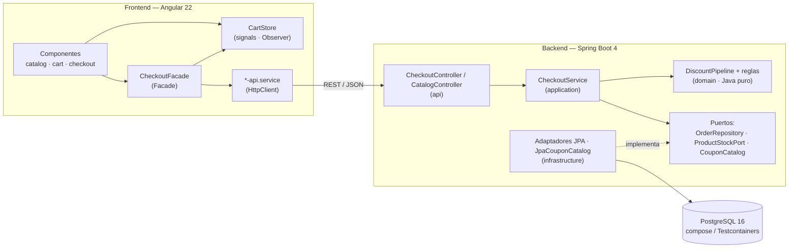
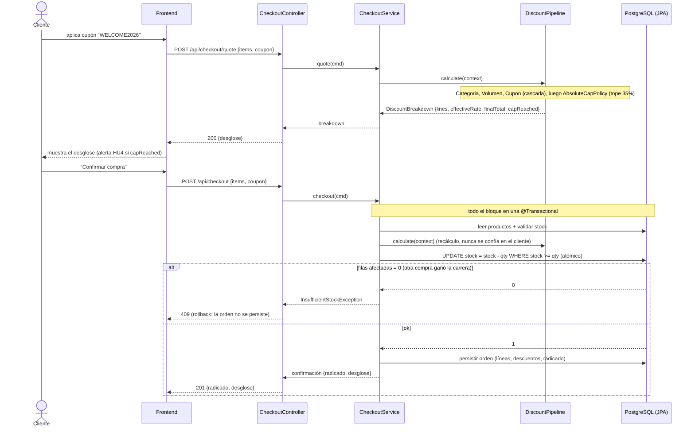

# Arquitectura — Core E-Commerce con Descuentos Acumulativos

> Justificación de la arquitectura: por qué este stack y diseño de carpetas, qué trade-offs
> se asumieron, cómo se aislaron las reglas matemáticas del motor de descuentos de la
> persistencia y el transporte, y qué patrones de diseño se aplicaron.

---

## 1. Contexto y objetivos de diseño

Se construye un MVP de checkout de e-commerce con un **motor de descuentos acumulativos
en cascada** y persistencia de órdenes. Lo que se evalúa no es la cantidad de código sino
el **criterio de ingeniería**: fundamentación de la arquitectura, patrones de
desacoplamiento, robustez del tipado, modularidad y una estrategia de pruebas con
cobertura ≥ 80 % en las capas lógicas.

Objetivos de diseño priorizados:

| # | Objetivo | Consecuencia de diseño |
|---|---|---|
| 1 | Que las reglas de negocio sean **exactas y verificables** | Motor de dominio puro + `BigDecimal` + tabla de casos como oráculo |
| 2 | Que las reglas estén **aisladas** de la persistencia y del transporte | Hexagonal-lite: dominio sin frameworks, puertos e infraestructura afuera |
| 3 | Que el catálogo de reglas sea **extensible** sin tocar el motor | Strategy + Factory + Pipeline |
| 4 | Que el frontend sea **reactivo** (subtotal en vivo, alerta del 35 %) | Store con signals (Observer) + Facade |
| 5 | **Realismo de entorno corporativo** | Misma base de datos (PostgreSQL) en dev, test y producción; esquema con Flyway |

---

## 2. Stack seleccionado y justificación

*(Responde a: «¿Por qué seleccionó ese stack tecnológico y diseño de carpetas para el problema?»)*

| Capa | Elección | Versión |
|---|---|---|
| Frontend | **Angular** (standalone components + signals) | 22 |
| Backend | **Spring Boot + Java** (build con **Gradle wrapper**) | Spring Boot 4.1, Java 17 |
| Acceso a datos | **Spring Data JPA / Hibernate** + **Flyway** (migraciones) | — |
| Base de datos | **PostgreSQL 16** | `compose.yaml` en ejecución · Testcontainers en tests |
| Test backend | **JUnit 5 + Mockito + JaCoCo** (gate de cobertura) + **Testcontainers** | — |
| Test frontend | **Vitest** (runner oficial de Angular 22) + cobertura v8 | — |
| CI | **GitHub Actions** | — |

### 2.1. Por qué Angular + Spring Boot + JPA

El problema combina un *motor de cálculo con reglas secuenciales, un invariante duro
(el 35 %) y persistencia transaccional* con una *interfaz reactiva*. **Angular + Spring Boot + JPA** 
resuelve cada una de esas piezas con herramientas de primera parte, sin depender de
librerías de terceros para lo crítico. Es además un stack corporativo consolidado (uso
extendido en banca y seguros), con soporte a largo plazo y ecosistema maduro de pruebas y
observabilidad. Detalle por pieza:

#### Java + Spring Boot (backend)

- **Exactitud decimal sin dependencias.** `BigDecimal` está en la *stdlib* con
  `RoundingMode` explícito → la cascada `T0 → −d1 → −d2 → −d3` y el truncamiento al 35 % se
  calculan con precisión controlada (escala 2, `HALF_UP`). El requisito de HU3 "totales
  desglosados **exactos**" es un problema de aritmética decimal, no de rendimiento; ningún
  lenguaje dinámico ofrece esto de fábrica (en JS haría falta `decimal.js`).
- **Tipos inmutables para los *value objects*.** `Money`, `DiscountBreakdown`,
  `DiscountLine` son `record`: no pueden mutar por accidente a mitad de la cascada. El
  tipado nominal fuerte de Java hace innecesario un equivalente a `any`.
- **Los patrones no son "forzados", son cómo se ensambla un bean.** La DI de Spring hace
  que *Strategy* (`DiscountRule`), *Factory* (`DiscountRuleFactory` → `DiscountPipeline`
  inyectable) y *Chain* sean el modo idiomático de construir el motor, no andamiaje extra.
- **Atomicidad de HU3 declarativa.** `@Transactional` sobre `checkout()` hace que
  *validar stock → recalcular → decrementar → persistir* sea todo-o-nada, con *rollback*
  automático ante `InsufficientStockException`. Es una anotación, no manejo manual de
  conexión/commit.
- **Rechazo de entradas corruptas en el borde.** Bean Validation (`@NotEmpty`,
  `@Positive`) en los DTOs de *request* → un carrito vacío o con datos corruptos se
  responde con `400` de forma declarativa, antes de llegar al dominio.
- **Ecosistema de pruebas maduro.** JUnit 5 `@ParameterizedTest` + `@MethodSource` consume
  la tabla del oráculo; *slices* `@WebMvcTest` / `@DataJpaTest` aíslan capas; **JaCoCo**
  aporta el *gate* de cobertura (`LINE` + `BRANCH`) como parte del build. Todo estándar,
  sin montar infraestructura de test.

#### Spring Data JPA + Flyway (persistencia)

- **El dominio queda 100 % libre de SQL.** El repositorio declarativo se implementa con
  casi cero código en el adaptador de infraestructura → los puertos del dominio
  (`OrderRepository`, `ProductRepository`) devuelven tipos de dominio, no filas.
- **Esquema versionado, auditable y reproducible.** Flyway (`V1`–`V7`) es la forma correcta
  en banca: cada cambio de esquema es un archivo revisable, sin `ddl-auto` "mágico".
  **Testcontainers corre las mismas migraciones** → lo que se prueba es el esquema real.
- **Control de concurrencia sin bloqueos pesimistas.** El decremento de stock es un
  `UPDATE ... SET stock = stock - :qty WHERE id = :id AND stock >= :qty`: la BD serializa
  los `UPDATE` sobre la fila y resuelve la carrera por "la última unidad" (ver
  [§4.1](#41-concurrencia-en-hu3)).

#### Angular (frontend)

- **El subtotal en vivo y la alerta del 35 % son estado *derivado*, no eventos.** Con
  **signals** + `computed`, el subtotal (HU1) y la visibilidad de la alerta (HU4) se
  declaran como fórmulas sobre el estado del carrito; no hay `subscribe`/`unsubscribe`
  manual ni fugas. `CartStore` es un *Observer* idiomático.
- **El tipado estricto llega al HTML.** `strictTemplates` hace que un *binding* a una
  propiedad inexistente **no compile** → el tipado de extremo a extremo cubre también la
  capa de vista, no solo el `.ts`.
- **Coordinar el *quote* de HU2 es una tubería, no un `setTimeout`.** RxJS
  (`toObservable` → `debounceTime(250 ms)` → `switchMap`) expresa "cada cambio del carrito
  dispara un `POST /checkout/quote`, con *debounce* y cancelación de la petición en vuelo"
  de forma declarativa.
- **Tooling integrado.** `ng test` (Vitest), `ng lint` (ESLint con
  `@typescript-eslint/no-explicit-any` como **error**) y `ng build` — un comando por tarea,
  umbral de cobertura en `angular.json`.

#### La combinación (contratos de extremo a extremo)

- **Contrato espejo revisable.** `record` de Java ↔ `interface` de TS en `core/models`: el
  mismo contrato a ambos lados, visible en el *diff* del PR.
- **Una sola verdad numérica.** `packages/fixtures/discount-cases.json` se deserializa
  igual en JUnit y en Vitest → si alguien rompe la paridad cliente/servidor, fallan las
  pruebas de ambos lados con el mismo caso.

### 2.2. Por qué PostgreSQL como base de datos

Persistir "en memoria" o en un fichero JSON minimiza la fricción de arranque, pero a costa
del realismo. Se prioriza el **realismo de entorno productivo**:

- **PostgreSQL 16** es una base relacional estándar para servicios nuevos en banca y
  seguros. Trabajar contra el motor real hace que el código de persistencia (tipos
  `numeric`, `timestamptz`, transacciones, índices) sea el de producción, no una
  aproximación.
- **Una sola base de datos en dev, test y producción.** Se evita el clásico *dialect
  drift* de usar H2 en tests y otro motor en producción (comportamientos distintos en
  fechas, `numeric`, *upserts*, *locking*). Los tests de integración corren contra
  PostgreSQL real vía **Testcontainers**.
- **Esquema versionado con Flyway** (`src/main/resources/db/migration/`, `V1`–`V7`):
  `V1` esquema, `V2` vista, `V3` datos de referencia (estados, categorías, cupones),
  `V4` catálogo + clientes de ejemplo, `V5`–`V7` cupón de prueba e imágenes. Hibernate
  queda en `ddl-auto: validate` (solo verifica que las entidades cuadren con el esquema).
  `ddl-auto: update` no es aceptable en producción. Detalle en `docs/modelo-datos.md`.
- **Arranque sin fricción real**: `apps/backend/compose.yaml` define el contenedor y
  `spring-boot-docker-compose` lo **levanta** en `./gradlew bootRun` (`lifecycle-management:
  start-only` → sigue vivo para inspeccionarlo). Único prerrequisito nuevo: Docker.
- La persistencia se puede inspeccionar con `psql` o cualquier cliente contra
  `localhost:5432`, y el `flyway_schema_history` deja traza del control de esquema.

El dominio y los repositorios siguen sin conocer el motor concreto (JPA + puertos): si
mañana el estándar fuese Oracle, el cambio se limita al driver y a `application.yml`.

### 2.3. Diseño de carpetas — monorepo

Estructura del monorepo:

```
examen-ecommerce/
├── apps/
│   ├── backend/          # Spring Boot 4 + Java 17 (Gradle)
│   │   ├── compose.yaml  # PostgreSQL 16 (lo levanta spring-boot-docker-compose en bootRun)
│   │   └── src/main/resources/db/migration/   # V1 esquema · V2 vista · V3-V4 seed (Flyway)
│   └── frontend/         # Angular 22 (standalone)
├── packages/
│   └── fixtures/         # discount-cases.json: oráculo de cálculo compartido por back y front
├── docs/
│   ├── arquitectura.md   # este documento
│   └── ia.md             # gobernanza de IA
├── .github/workflows/    # CI: build + tests + gates de cobertura
├── .claude/              # sub-agentes y skills usados (ver docs/ia.md)
└── README.md
```

- **Monorepo** porque back y front evolucionan juntos en este MVP y una única clonación /
  un único historial de commits facilitan la evaluación. No se usa una herramienta de
  monorepo (Nx, Turborepo): son dos apps heterogéneas (Java + TS) sin código ejecutable
  compartido; el peso de esa herramienta no se justifica.
- **`packages/fixtures/`**: un único artefacto compartido de verdad — la tabla
  `carrito + cupón → desglose esperado`. La consumen las pruebas de JUnit y las de Vitest,
  de modo que **ambos lados verifican contra los mismos números**.

#### Backend — *package-by-feature* + capas

```
com.grupobolivar.ecommerce
├── catalog/
│   ├── domain/                  # Product (record), ProductRepository (interfaz)   (Java puro)
│   ├── application/             # CatalogService
│   ├── infrastructure/          # ProductEntity + detalle + vista rating, ProductJpaRepository,
│   │                            #   ProductRepositoryAdapter (único que toca la entidad)
│   └── api/                     # CatalogController, ProductResponse (record)
├── checkout/
│   ├── domain/
│   │   ├── model/               # Money, CartItem, Cart               (Java puro)
│   │   ├── discount/            # motor de descuentos                 (Java puro)
│   │   │   ├── DiscountRule            (Strategy)
│   │   │   ├── CategoryDiscountRule · VolumeDiscountRule · CouponDiscountRule
│   │   │   ├── DiscountPipeline        (Chain of Responsibility)
│   │   │   ├── AbsoluteCapPolicy       (post-procesador del tope 35 %)
│   │   │   ├── DiscountRuleFactory     (Factory)
│   │   │   └── DiscountContext · DiscountBreakdown · DiscountLine
│   │   └── coupon/              # Coupon, CouponCatalog (puerto)
│   ├── application/             # CheckoutService + puertos (ProductStockPort,
│   │                            #   DiscountSettingsProvider) — HU3: OrderRepository
│   ├── infrastructure/          # entidades JPA, JpaCouponCatalog, adaptadores, DiscountProperties
│   └── api/                     # CheckoutController, DTOs (record)
└── shared/api/                  # GlobalExceptionHandler, ErrorResponse
```

Se agrupa **por feature** (catalog / checkout) y dentro de cada feature por **capa**
(`domain / application / infrastructure / api`). Esto mantiene junto lo que cambia junto y
deja explícita la dirección de las dependencias: `api → application → domain`, y
`infrastructure → domain` (implementa sus puertos). El dominio no depende de nadie.

#### Frontend — core / features / shared

```
src/app/
├── core/
│   ├── models/     # interfaces del contrato REST (Product, Cart, DiscountBreakdown)
│   ├── api/        # catalog-api.service, checkout-api.service (HttpClient)
│   └── state/      # cart.store (signals, Observer) · checkout.facade (Facade)
├── features/
│   ├── catalog/    # listado de productos
│   ├── cart/       # carrito y subtotal en vivo (HU1)
│   └── checkout/   # cupón + desglose (HU2) · alerta del 35 % (HU4)
└── shared/         # pipes, componentes de presentación
```

---

## 3. Trade-offs asumidos

*(Responde a: «¿Qué trade-offs de arquitectura asumió?»)*

| Trade-off | Decisión | Se gana | Se cede |
|---|---|---|---|
| Simplicidad **vs.** extensibilidad del motor | Strategy + Factory + Pipeline en vez de un método con `if`s | Cada regla se testea aislada; agregar una regla no toca las demás | Más clases y más indirección para 3 reglas |
| Ceremonia **vs.** pureza de dominio | **Repository**: interfaz en el dominio (`ProductRepository`, `CouponCatalog`) que devuelve records, adaptador JPA en infra | La entidad no sale de un adaptador; `CatalogService` es unit-testeable sin BD; estilo único en catalog/checkout/orders | Un salto de mapeo extra (`Entity → Product → Response`) e interfaz + adaptador por agregado |
| Exactitud **vs.** rendimiento de cálculo | `BigDecimal` (escala 2, HALF_UP) en vez de `double` | Totales exactos y reproducibles; sin deriva de coma flotante en la cascada | Aritmética algo más lenta (irrelevante a esta escala) |
| Realismo **vs.** fricción de arranque | PostgreSQL real (compose + Testcontainers) en vez de H2 embebida | Paridad dev/test/prod, sin *dialect drift*; el código de persistencia es el "de verdad" | Requiere Docker para ejecutar y para los tests de integración |
| Migraciones **vs.** velocidad inicial | Flyway (`ddl-auto: validate`) en vez de `ddl-auto: update` | Esquema explícito, versionado y revisable; práctica correcta en banca | Hay que mantener los scripts `V__*.sql` a la par de las entidades |
| Superficie de API **vs.** aislamiento de efectos | Dos endpoints: `POST /checkout/quote` (sin efectos) y `POST /checkout` (con efectos) | HU2/HU4 se recalculan en vivo sin mutar stock; los efectos colaterales viven en un solo lugar | Un endpoint más que mantener y documentar |
| Velocidad de entrega **vs.** cobertura amplia | La verificación de cobertura del 80 % se restringe a `checkout.domain` + `checkout.application` (y equivalentes de catalog) | El gate protege la lógica que importa; no penaliza DTOs/entidades sin lógica | La cobertura global reportada es menor que la de las capas esenciales |
| Runner de test del frontend | **Vitest**, el default de Angular 22 (no se migra a Jest ni se vuelve a Karma) | Cero configuración que justificar; rápido en CI; soportado oficialmente | Ecosistema de *matchers*/mocks más nuevo que el de Jest |

### 3.1. Observación de ingeniería sobre el tope del 35 %

Con el catálogo de reglas por defecto, el descuento **máximo alcanzable** es:

```
cascada:  1 − (1 − 0.10)·(1 − 0.05)·(1 − 0.15) = 1 − 0.90·0.95·0.85 ≈ 0.27325  → 27,33 %
aditivo:  0.10 + 0.05 + 0.15                                              = 0.30     → 30,00 %
```

Es decir, **el tope del 35 % es teóricamente inalcanzable con `WELCOME2026`** (además, la
regla 1 aplica solo al subtotal de la categoría, con lo que el efecto real es aún menor).
Aun así, `AbsoluteCapPolicy` se implementa como **invariante defensiva** — protege el
margen ante futuras reglas o cupones más agresivos — y los porcentajes viven en
configuración (`discount.cap.percent`) o en datos (`coupons.discount_rate`).

Para poder **probar y demostrar** el truncamiento se siembra un cupón de prueba en
`db/migration/V5__seed_demo_coupon.sql`: **`MEGADESCUENTO` (50 %)**. Con 5 unidades de un
producto de "Tecnología" (125,00) la cascada da `10 % → 5 % → 50 %` ≈ 57,25 % de descuento;
`AbsoluteCapPolicy` lo trunca **exactamente en 35 %** → `totalDiscount = 43,75`,
`finalTotal = 81,25`, `effectiveRate = 0,3500` y `capReached = true`, que es lo que dispara
la **alerta persistente de HU4** en el frontend (`savings-limit-alert.component`, texto
fijo y `role="alert"`). El flag `capReached` se persiste en la orden (`orders.cap_reached`).

Cobertura del truncamiento: test directo de `AbsoluteCapPolicy` con un descuento sintético
> 35 %; caso `tope-35-alcanzado-con-cupon-de-prueba` del oráculo compartido
(`DiscountPipelineTest`); y `CheckoutIntegrationTest` end-to-end (`/api/checkout/quote` y
`/api/checkout` + `/api/orders/{radicado}`).

---

## 4. Aislamiento del motor de descuentos

*(Responde a: «¿Cómo aisló las reglas matemáticas del motor de descuentos de los detalles
de persistencia y controladores de la API?»)*

1. **Dominio sin frameworks.** Los paquetes `checkout/domain/model` y
   `checkout/domain/discount` son Java puro: no importan `org.springframework.*`,
   `jakarta.persistence.*` ni tipos de la capa web. Está declarado en
   `checkout/domain/package-info.java` y se respeta por revisión de código.
2. **Entrada y salida como datos planos.** El motor recibe un `DiscountContext`
   (un `Cart` de records + el código de cupón) y devuelve un `DiscountBreakdown`
   (value object inmutable). No conoce HTTP, JSON ni filas de base de datos.
3. **Dependencias hacia afuera como interfaces del dominio (patrón Repository).** Lo que el
   dominio necesita del exterior se expresa como interfaces que **él** define y que
   devuelven **tipos de dominio**, no entidades JPA:
   - `catalog/domain/ProductRepository` → devuelve `Product` (record). Implementada por
     `catalog/infrastructure/ProductRepositoryAdapter`, **la única clase que toca
     `ProductEntity`**.
   - `checkout/domain/coupon/CouponCatalog` → devuelve `Coupon`. Implementada por
     `JpaCouponCatalog` (lee la tabla `coupons` + vigencia).
   - `ProductStockPort` es el **puerto de salida** de `checkout` (interfaz en su capa
     `application`). Lo **implementa** el adaptador `CatalogProductStockAdapter`
     (`checkout/infrastructure`), que consume el `ProductRepository` de `catalog` y
     traduce `Product` → `ProductSnapshot`. Así **el dominio de `checkout` no se acopla ni
     a la JPA ni al dominio de `catalog`**: solo conoce su propio contrato.
4. **Orquestación separada del cálculo.** `CheckoutService` (capa `application`) coordina
   *resolver el carrito → invocar el motor → (HU3: descontar stock → persistir)* y depende
   de esas interfaces. El **cálculo** vive entero en `DiscountPipeline`; el servicio no hace
   aritmética de descuentos.
5. **Controladores delgados.** `CatalogController` / `CheckoutController` solo mapean
   dominio ↔ DTO y delegan. Sin lógica de negocio.

Resultado: el motor y los servicios se prueban con dobles en memoria, sin Spring y sin base
de datos — los tests del `DiscountPipeline` y de `CatalogService` son unitarios puros; solo
los adaptadores (`ProductRepositoryAdapter`, `@DataJpaTest`) tocan PostgreSQL.

### 4.1. Concurrencia en HU3

Escenario: *dos compras simultáneas por la última unidad*. El
`checkout()` es `@Transactional` y ordena las operaciones como **resolver carrito → validar
stock (lectura) → recalcular cascada → decrementar stock → persistir orden**. La lectura de
validación por sí sola sufre una condición de carrera (*check-then-act*): ambas
transacciones podrían leer `stock = 1` y proceder.

La garantía real está en el **decremento**, que no es un `read-modify-write` en memoria sino
un **UPDATE condicional atómico** en la base:

```sql
UPDATE products SET stock = stock - :qty WHERE id = :id AND stock >= :qty
```

Postgres serializa los `UPDATE` sobre la misma fila: la primera transacción afecta 1 fila,
la segunda afecta **0**. `CheckoutService` comprueba el número de filas afectadas y, si es
`0`, lanza `InsufficientStockException` (HTTP 409) y la transacción hace *rollback* — la
orden no se persiste. Es decir, la condición de stock se vuelve a evaluar **dentro** de la
escritura atómica, no solo en la lectura previa.

Alternativa considerada y descartada por sobrecoste para este MVP: bloqueo pesimista
(`SELECT ... FOR UPDATE` vía `@Lock(PESSIMISTIC_WRITE)`) sobre la fila del producto. El
`UPDATE` guardado da la misma garantía de corrección con menos contención y sin `SELECT`
extra. El *trade-off*: no se distingue "producto inexistente" de "sin stock" en la ruta de
concurrencia (ambos → 0 filas), pero esa ambigüedad es inocua porque la validación previa
ya devolvió 404 para un id inexistente.

---

## 5. Patrones de diseño implementados

*(Responde a: «Describir e implementar explícitamente en el código al menos dos patrones
de diseño.» — se implementan cinco: Strategy, Factory, Chain of Responsibility, Observer y
Repository, más Adapter y Facade de apoyo.)*

### 5.1. Strategy — `DiscountRule` (backend)

`checkout/domain/discount/DiscountRule.java` define
`Money computeDiscount(DiscountContext, Money runningTotal)`. Cada descuento acumulativo
es una implementación independiente:

- `CategoryDiscountRule` — 10 % sobre el subtotal de la categoría "Tecnología".
- `VolumeDiscountRule` — 5 % si el total corriente **supera** $100 (umbral estricto).
- `CouponDiscountRule` — 15 % si hay un cupón activo (consulta el puerto `CouponCatalog`).

Cada estrategia se testea en aislamiento. Agregar un descuento nuevo = una clase nueva.

### 5.2. Factory — `DiscountRuleFactory` (backend)

`createPipeline(DiscountConfig, CouponCatalog)` construye la cadena de reglas **en su orden
de precedencia** (Categoría → Volumen → Cupón) y arma el `DiscountPipeline` con su
`AbsoluteCapPolicy`. El orden y la configuración quedan en un solo lugar; ningún otro
componente instancia reglas ni conoce la precedencia.

### 5.3. Chain of Responsibility / Pipeline — `DiscountPipeline` (backend)

`DiscountPipeline.calculate(...)` recorre las reglas en orden y pasa a cada una el
**total corriente** resultante de la anterior — de ahí que la acumulación sea
**multiplicativa en cascada** y no una suma de porcentajes. Al final delega en
`AbsoluteCapPolicy.enforce(...)` el tope del 35 %.

### 5.4. Observer — `CartStore` (frontend)

`core/state/cart.store.ts` mantiene el estado del carrito con **signals** de Angular y
expone estado derivado (`subtotal`, `itemCount`) como `computed(...)`. Los componentes
(listado, resumen, alerta del 35 %) **reaccionan** a los cambios sin suscripciones
manuales. Es la implementación idiomática del patrón Observer en Angular.

### 5.5. Repository — `ProductRepository` / `CouponCatalog` (backend)

Cada agregado se accede a través de una **interfaz que define el dominio** y que devuelve
**objetos de dominio**, nunca entidades JPA:

| Interfaz (dominio) | Devuelve | Implementación (infra) |
|---|---|---|
| `catalog/domain/ProductRepository` | `Product` (record) | `catalog/infrastructure/ProductRepositoryAdapter` |
| `checkout/domain/coupon/CouponCatalog` | `Coupon` | `checkout/infrastructure/JpaCouponCatalog` |

**Por qué ayuda al proyecto** (decisión técnica):

- **Aislamiento** — la entidad `ProductEntity` (con su detalle 1:1 y la vista de rating)
  queda encerrada en `ProductRepositoryAdapter`. `CatalogService`, el DTO `ProductResponse`
  y hasta el módulo `checkout` trabajan con el record `Product` — el dominio nunca ve una
  entidad JPA.
- **Tests rápidos** — `CatalogServiceTest` es unitario con un `ProductRepository` mockeado;
  Testcontainers solo se usa donde de verdad se prueba SQL (`ProductRepositoryAdapterTest`,
  `@DataJpaTest`).
- **Consistencia** — `checkout` ya usaba este estilo (puertos que devuelven dominio);
  el refactor pone `catalog` en la misma línea y deja a HU3 (`OrderRepository.save(order)`)
  encajando de forma natural con el agregado de dominio.
- **Contrato estable** — cambiar el mapeo de columnas o el motor de persistencia no toca
  ni la aplicación ni la API: solo el adaptador.

*Trade-off asumido:* un salto de mapeo extra (`Entity → Product → Response`) y una interfaz
+ un adaptador por agregado. A cambio se gana pureza de dominio y velocidad de test; para
lecturas triviales es algo de ceremonia, pero la coherencia entre features lo compensa.

### Patrones de apoyo

- **Adapter** (backend): `ProductRepositoryAdapter`, `JpaCouponCatalog`,
  `CatalogProductStockAdapter`, `DbDiscountSettingsProvider` adaptan JPA / config a las
  interfaces del dominio.
- **Facade** (frontend): `checkout.facade.ts` oculta a los componentes la coordinación
  entre el `HttpClient` y el `CartStore`. Cada cambio de carrito o cupón dispara un
  `POST /api/checkout/quote`, pero pasa por un `debounceTime(250 ms)` + `switchMap` (RxJS)
  para no inundar el backend mientras el usuario teclea y para cancelar la petición en
  vuelo si llega otra. También mapea la respuesta a *view-model* y maneja los errores 4xx/5xx.

---

## 6. Contratos REST y tipado estricto

- **Endpoints:**

  | Método | Ruta | Efectos | Historia |
  |---|---|---|---|
  | `GET` | `/api/products` | — | HU1 |
  | `GET` | `/api/products/{id}` | — | detalle de producto (marca, reseñas) |
  | `POST` | `/api/checkout/quote` | ninguno (no toca stock ni BD) | HU2, HU4 |
  | `POST` | `/api/checkout` | valida stock → recalcula → descuenta stock → persiste (`@Transactional`) | HU3 |
  | `GET` | `/api/orders` | — | lista "Mis compras" (20 más recientes) |
  | `GET` | `/api/orders/{radicado}` | — | detalle de una orden persistida |

- **Errores** vía `GlobalExceptionHandler`: `400` cuerpo inválido o carrito vacío ·
  `404` producto u orden inexistente · `409` stock insuficiente. Un **cupón inválido o
  expirado no es error**: se ignora (no aparece la línea `COUPON` en el desglose) y el
  frontend lo señala en línea; así el `quote` sigue siendo idempotente y sin efectos.
- **Backend:** DTOs como `record` + Bean Validation (`@NotEmpty`, `@Positive`). Sin `any`
  posible en Java.
- **Frontend:** `strict: true`, `strictTemplates: true`, `noImplicitAny: true` en
  `tsconfig.json`; ESLint con `@typescript-eslint/no-explicit-any` como **error**.
  Las interfaces de `core/models` reflejan el contrato del backend.
- **Fuente de verdad numérica:** `packages/fixtures/discount-cases.json`.

---

## 7. Estrategia de pruebas y cobertura

- **Requisito:** ≥ 80 % en las capas lógicas esenciales de front (estado del carrito,
  alerta) y back (motor de descuentos, validación de stock) + tests de *edge cases*.
- **Backend** (JUnit 5 + Mockito + JaCoCo): dos niveles claramente separados.
  - *Unitarios, sin base de datos* (Java puro): un test por `DiscountRule`;
    `DiscountPipeline` con `@ParameterizedTest` alimentado por `discount-cases.json`;
    `AbsoluteCapPolicy` con entrada sintética > 35 %; `CheckoutService` con mocks de los
    puertos. Aquí vive el grueso de la cobertura exigida.
  - *Integración, contra PostgreSQL real* (Testcontainers, `@ServiceConnection`):
    `SchemaMigrationTest` valida Flyway; `@DataJpaTest` para los repositorios; *slice* de
    `@WebMvcTest` para el controlador; `@SpringBootTest` para el flujo de checkout completo.
  - El gate `jacocoTestCoverageVerification` falla el build si `LINE` o `BRANCH` < 0.80 en
    los paquetes `checkout.domain` / `checkout.application` (y equivalentes de catalog).
- **Frontend** (Vitest): `cart.store` (alta/baja/cantidad, subtotal, tope de stock, carrito
  corrupto); `catalog.store`; `checkout.facade` (*quote* con debounce, mapeo, errores
  4xx/5xx, `capReached`, `confirm`); servicios de datos; `discount-breakdown` y
  `savings-limit-alert` (visible solo si `capReached`, texto exacto, `role="alert"`); y los
  componentes de `catalog` / `cart` / `orders` / `landing` (render, interacción, estados).
  Umbrales de cobertura al 80 % (statements / branches / functions / lines) en `angular.json`.
- **Qué se excluye de la cobertura y por qué:** solo `core/models/**` (interfaces sin
  lógica ejecutable) y `app.ts` (bootstrap de Angular). Todo lo demás — *stores*, *facade*,
  servicios y componentes — se mide. El gate real y su regla ("nunca bajar el umbral") lo
  refuerza el sub-agente `auditor-cobertura` (ver [`ia.md`](ia.md) §2.1).
- **Edge cases obligatorios:** tope del 35 % superado · carrito vacío o con datos
  corruptos · cupón no registrado o expirado · compra sin stock suficiente (incluida la
  variante de carrera concurrente, ver §4.1).

Comandos: ver [`README.md`](../README.md). En CI los corre
[`.github/workflows/ci.yml`](../.github/workflows/ci.yml) en cada *push* y PR.

---

## 8. Diagrama

### Componentes



### Secuencia — checkout con cascada y tope



---

## 9. Cómo ejecutar

Instrucciones completas (variables de entorno, conexión a la base, edge cases) en
[`README.md`](../README.md). Resumen para una instalación desde cero.

### Prerrequisitos

- **JDK 17**, **Node.js 22.22.3+** y npm.
- **Docker** en marcha. Es el único servicio externo: no hay que instalar ni PostgreSQL ni
  Gradle (se usa el *wrapper*).

### La base de datos: nada que crear a mano

No hay que crear la base, ni el usuario, ni ejecutar ningún `.sql`. Al arrancar el backend:

```bash
cd apps/backend && ./gradlew bootRun          # → http://localhost:8080
```

1. **`spring-boot-docker-compose`** lee `apps/backend/compose.yaml` y **levanta un contenedor
   PostgreSQL 16** (`ecommerce-postgres`) en `localhost:5432`, con base `ecommerce` y
   usuario/clave `ecommerce` / `ecommerce`. Con `lifecycle-management: start-only` el
   contenedor **sigue vivo** al parar la app (para poder inspeccionarlo).
2. Spring conecta el *datasource* automáticamente (config por defecto en `application.yml`).
3. **Flyway** ejecuta las migraciones `V1`–`V7` de `src/main/resources/db/migration/` sobre
   esa base **al iniciar**: crea las 11 tablas + la vista y carga los datos de referencia y
   el catálogo de ejemplo. Hibernate queda en `ddl-auto: validate` (solo comprueba que las
   entidades cuadren con el esquema; no lo modifica).

Resultado: `git clone` + `./gradlew bootRun` deja la API operativa con la base creada,
migrada y poblada. Para inspeccionarla:

```bash
cd apps/backend
docker compose exec postgres psql -U ecommerce -d ecommerce   # o un cliente externo a localhost:5432
```

Para empezar de cero otra vez: `docker compose down -v` (borra el volumen) → el siguiente
`bootRun` recrea todo desde las migraciones.

### Usar un PostgreSQL propio (sin el contenedor)

```bash
export SPRING_DOCKER_COMPOSE_ENABLED=false
export SPRING_DATASOURCE_URL=jdbc:postgresql://<host>:5432/<base>
export SPRING_DATASOURCE_USERNAME=<user>
export SPRING_DATASOURCE_PASSWORD=<pass>
cd apps/backend && ./gradlew bootRun
```

La base de datos destino debe existir y estar vacía; **Flyway crea el esquema y los datos**
igual que en el caso anterior.

### Frontend

```bash
cd apps/frontend && npm install && npm start   # → http://localhost:4200 (proxy /api → :8080)
```

### Pruebas + cobertura

```bash
cd apps/backend  && ./gradlew check   # tests + gate JaCoCo 80%. Necesita Docker: los tests de
                                      # integración levantan su propio PostgreSQL efímero con
                                      # Testcontainers y corren las mismas migraciones V1–V7.
cd apps/frontend && npm test          # ng test (runner Vitest) + cobertura, umbral 80%
```
