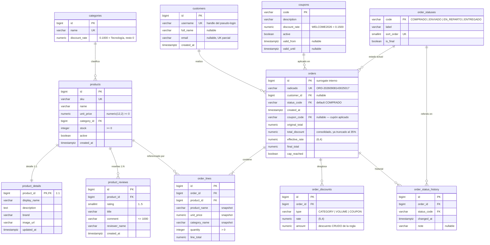

# Modelo de datos

> Esquema relacional (PostgreSQL 16) derivado de los requisitos del enunciado, más una
> gestión ligera de **clientes** (sin autenticación) y del **ciclo de vida de la orden**.
> **Implementado** en `apps/backend/src/main/resources/db/migration/` (V1–V4) — ver §8.

**Alcance:** MVP del enunciado (catálogo → carrito → motor de descuentos → orden) +
pseudo-login por nombre de usuario en el frontend + estados del pedido. **No** hay
contraseñas, sesiones ni carrito persistido.

---

## 1. De los requisitos al modelo

| Requisito / decisión | Necesidad de datos |
|---|---|
| HU1: productos con `id, nombre, precio, categoría, stock` | `products` + `categories` |
| Regla 1: 10 % a la categoría "Tecnología" | `categories.discount_rate` (la tasa es dato) |
| Regla 3: cupón `WELCOME2026` = 15 % · edge "no registrado / expirado" | `coupons` con `active` + vigencia |
| HU3: persistir la orden con **totales desglosados exactos** | `orders` + `order_lines` + `order_discounts` |
| Regla 4: tope del 35 % | se persiste `orders.cap_reached` / `effective_rate` |
| Edge: compra sin stock | `products.stock` con `check (>= 0)` + validación en el servicio |
| Producto con detalle y reseñas | `product_details` (1:1) + `product_reviews` (1:N) |
| Orden con radicado `LETRAS-NÚMERO` | `orders.radicado` |
| Pseudo-login: "poné tu usuario y ve tus compras" | `customers` (sin auth) + `orders.customer_id` |
| "Órdenes activas del cliente" con estados | `order_statuses` (catálogo) + `order_status_history` |

> «Compras y ventas»: desde la óptica del cliente cada orden es una compra; desde la óptica
> de la tienda, una venta. Es **la misma** entidad `orders` — no se modela algo aparte.

---

## 2. Diagrama entidad-relación



**11 tablas + 1 vista** (`product_rating_summary`).

---

## 3. Diccionario de tablas

### 3.1. `customers` — cliente (sin autenticación)

| Columna | Tipo | Restricciones | Notas |
|---|---|---|---|
| `id` | `bigint` | PK identity | |
| `username` | `varchar(40)` | `not null`, `unique`, `check (username ~ '^[a-z0-9_.-]{3,40}$')` | el "usuario" que se escribe en el front |
| `full_name` | `varchar(120)` | nullable | opcional |
| `email` | `varchar(160)` | nullable, `unique` parcial (`where email is not null`) | opcional |
| `created_at` | `timestamptz` | `not null default now()` | |

> Sin `password`, sin `role`, sin sesión. El "login" es identificación, no autenticación.
> Los clientes son **datos maestros**: salen del seed. El pseudo-login es un **lookup**
> (`GET /api/customers/{username}`); si no existe, `404`. El backend **no** crea clientes
> al vuelo desde el front.

### 3.2. `categories`

| Columna | Tipo | Restricciones | Notas |
|---|---|---|---|
| `id` | `bigint` | PK identity | |
| `name` | `varchar(60)` | `not null`, `unique` | |
| `discount_rate` | `numeric(5,4)` | `not null default 0`, `check (>= 0 and < 1)` | Regla 1 como dato. `Tecnología = 0.1000`. |

### 3.3. `products` — cabeza

| Columna | Tipo | Restricciones | Notas |
|---|---|---|---|
| `id` | `bigint` | PK identity | |
| `sku` | `varchar(40)` | `not null`, `unique` | clave de negocio (`TEC-LAP-014`) |
| `name` | `varchar(120)` | `not null` | nombre canónico |
| `unit_price` | `numeric(12,2)` | `not null`, `check (>= 0)` | dinero → `numeric`, nunca `float` |
| `category_id` | `bigint` | `not null`, `references categories(id)` | |
| `stock` | `integer` | `not null`, `check (>= 0)` | se decrementa en la compra |
| `active` | `boolean` | `not null default true` | retiro lógico |
| `created_at` | `timestamptz` | `not null default now()` | |

Índice: `idx_products_category_id (category_id)`.

### 3.4. `product_details` — detalle 1:1

| Columna | Tipo | Restricciones | Notas |
|---|---|---|---|
| `product_id` | `bigint` | **PK**, `references products(id) on delete cascade` | la PK *es* la FK ⇒ 1:1 estricto |
| `display_name` | `varchar(160)` | `not null` | nombre para la tienda |
| `description` | `text` | | |
| `brand` | `varchar(80)` | | |
| `image_url` | `varchar(500)` | | |
| `updated_at` | `timestamptz` | `not null default now()` | |

### 3.5. `product_reviews` — reseñas 1:N

| Columna | Tipo | Restricciones | Notas |
|---|---|---|---|
| `id` | `bigint` | PK identity | |
| `product_id` | `bigint` | `not null`, `references products(id) on delete cascade` | |
| `rating` | `smallint` | `not null`, `check (between 1 and 5)` | |
| `title` | `varchar(120)` | | |
| `comment` | `varchar(1000)` | | |
| `reviewer_name` | `varchar(120)` | `not null` | |
| `created_at` | `timestamptz` | `not null default now()` | |

Índice: `idx_product_reviews_product_id (product_id)`.

### 3.6. `product_rating_summary` — vista

```sql
create view product_rating_summary as
select p.id as product_id,
       count(r.id) as review_count,
       coalesce(round(avg(r.rating)::numeric, 2), 0) as rating_average
from products p
left join product_reviews r on r.product_id = p.id
group by p.id;
```

Dato derivado → no se almacena. Si el rendimiento lo exigiera, vista materializada.

### 3.7. `coupons`

| Columna | Tipo | Restricciones | Notas |
|---|---|---|---|
| `code` | `varchar(40)` | **PK** (natural, mayúsculas) | `WELCOME2026` |
| `description` | `varchar(160)` | | |
| `discount_rate` | `numeric(5,4)` | `not null`, `check (> 0 and <= 1)` | `0.1500` |
| `active` | `boolean` | `not null default true` | |
| `valid_from` | `timestamptz` | nullable | |
| `valid_until` | `timestamptz` | nullable | |

**Aplicable** ⇔ `active` **y** dentro de `[valid_from, valid_until]` (nulls = sin límite).
*No registrado* = sin fila; *expirado* = `valid_until < now()` o `active = false`.

### 3.8. `order_statuses` — catálogo de estados

| Columna | Tipo | Restricciones | Notas |
|---|---|---|---|
| `code` | `varchar(16)` | **PK** | `COMPRADO`, `ENVIADO`, `EN_REPARTO`, `ENTREGADO` |
| `label` | `varchar(40)` | `not null` | "Comprado", "En reparto"… |
| `sort_order` | `smallint` | `not null`, `unique` | orden del flujo (1..4) |
| `is_final` | `boolean` | `not null default false` | `true` solo para `ENTREGADO` |

> Estados como **datos**: agregar "DEVUELTO" es un `insert`. El servicio solo permite
> avanzar (`sort_order` creciente) y no pasar de un estado `is_final`.

### 3.9. `orders` — cabeza

| Columna | Tipo | Restricciones | Notas |
|---|---|---|---|
| `id` | `bigint` | PK identity | surrogate interno (FKs apuntan aquí) |
| `radicado` | `varchar(24)` | `not null`, `unique`, `check (radicado ~ '^[A-Z]{2,5}-[0-9]{14,17}$')` | clave de negocio — ver §4.2 |
| `customer_id` | `bigint` | nullable, `references customers(id)` | el flujo del front siempre lo envía tras el pseudo-login |
| `status_code` | `varchar(16)` | `not null default 'COMPRADO'`, `references order_statuses(code)` | estado **actual** (denormalizado para consultas rápidas) |
| `created_at` | `timestamptz` | `not null default now()` | |
| `coupon_code` | `varchar(40)` | nullable, `references coupons(code)` | cupón **efectivamente aplicado** |
| `original_total` | `numeric(12,2)` | `not null` | Σ `line_total` |
| `total_discount` | `numeric(12,2)` | `not null`, `check (>= 0)` | consolidado, **ya truncado** al 35 % |
| `effective_rate` | `numeric(6,4)` | `not null` | `total_discount / original_total` |
| `final_total` | `numeric(12,2)` | `not null`, `check (>= 0)` | `original_total - total_discount` |
| `cap_reached` | `boolean` | `not null` | dispara HU4 |

Índices: `idx_orders_customer_id (customer_id)`, `idx_orders_status_code (status_code)`.

### 3.10. `order_lines`

| Columna | Tipo | Restricciones | Notas |
|---|---|---|---|
| `id` | `bigint` | PK identity | |
| `order_id` | `bigint` | `not null`, `references orders(id) on delete cascade` | |
| `product_id` | `bigint` | `not null`, `references products(id)` | trazabilidad |
| `product_name` | `varchar(160)` | `not null` | **snapshot** (`display_name` del momento) |
| `unit_price` | `numeric(12,2)` | `not null` | **snapshot** |
| `category_name` | `varchar(60)` | `not null` | **snapshot** (reconstruye la Regla 1) |
| `quantity` | `integer` | `not null`, `check (> 0)` | |
| `line_total` | `numeric(12,2)` | `not null` | `unit_price * quantity` |

Índice: `idx_order_lines_order_id (order_id)`.

### 3.11. `order_discounts` — el desglose

| Columna | Tipo | Restricciones | Notas |
|---|---|---|---|
| `id` | `bigint` | PK identity | |
| `order_id` | `bigint` | `not null`, `references orders(id) on delete cascade` | |
| `type` | `varchar(16)` | `not null`, `check (type in ('CATEGORY','VOLUME','COUPON'))` | |
| `rate` | `numeric(5,4)` | `not null` | tasa aplicada en ese paso |
| `amount` | `numeric(12,2)` | `not null`, `check (>= 0)` | descuento **crudo** de esa regla (antes del tope) |

`unique (order_id, type)`. Índice: `idx_order_discounts_order_id (order_id)`.

### 3.12. `order_status_history`

| Columna | Tipo | Restricciones | Notas |
|---|---|---|---|
| `id` | `bigint` | PK identity | |
| `order_id` | `bigint` | `not null`, `references orders(id) on delete cascade` | |
| `status_code` | `varchar(16)` | `not null`, `references order_statuses(code)` | |
| `changed_at` | `timestamptz` | `not null default now()` | |
| `note` | `varchar(200)` | nullable | |

Índice: `idx_order_status_history_order_id (order_id)`. Al crear la orden se inserta la
primera fila (`COMPRADO`).

---

## 4. Decisiones de modelado

### 4.1. Producto: cabeza + detalle + reseñas
`products` = lo transaccional (precio, stock, categoría) — lo único que toca el motor de
descuentos. `product_details` (PK = FK) = lo presentacional, **partición vertical
deliberada** (no la exige ninguna forma normal; separa responsabilidades y ciclos de
cambio). `product_reviews` = 1:N; el promedio de estrellas no se guarda (vista).

### 4.2. `orders.radicado`
Formato **`PREFIJO-NÚMERO`**:
- **PREFIJO**: 2–5 letras mayúsculas, configurable (`order.reference.prefix`, defecto `ORD`).
- **NÚMERO**: fecha+hora de creación como natural, patrón `yyyyMMddHHmmssSSS`
  (con milésimas), zona `America/Bogota`.
- Ej.: 8/09/2026 14:30:25.017 → **`ORD-20260908143025017`**.
- Lo genera la **aplicación** desde el mismo `Instant` que `created_at`. `id` sigue siendo
  la PK surrogate; `radicado` es la clave expuesta en la API (`GET /api/orders/{radicado}`).
- `unique` + `check` de formato. Colisión solo en la misma milésima → el `unique` la
  rechaza y el servicio reintenta.

### 4.3. Cliente y pseudo-login
`customers` sin credenciales, poblada por el seed. Flujo:
1. El front pide "usuario" → `GET /api/customers/{username}`.
2. Si existe, devuelve `{ id, username, fullName, email }`; si no, `404` y el front muestra
   "usuario no válido". **No** se crea el cliente automáticamente.
3. El front guarda el usuario (signal + `localStorage`) y lo envía en el checkout.
4. `GET /api/customers/{username}/orders` → lista de compras con su estado.

Es identificación, **no** seguridad. Se documenta explícitamente en `arquitectura.md` que
la autenticación real queda fuera del alcance. Alta de clientes nuevos: fuera del MVP
(bastan los del seed); si se necesitara, un endpoint explícito `POST /api/customers`.

### 4.4. Estado de la orden
Estado **actual** denormalizado en `orders.status_code` (consultas rápidas de "activas") +
**historial** completo en `order_status_history`. La orden nace `COMPRADO`. Transiciones
solo hacia adelante (`sort_order` creciente), nunca desde un estado `is_final`.
"Órdenes activas del cliente" = `join order_statuses where is_final = false`.

---

## 5. Normalización

| Forma | Cumplimiento |
|---|---|
| **1FN** | Columnas atómicas; reseñas, líneas e historial de estados en sus propias tablas. |
| **2FN** | PK de una sola columna en todas las tablas; sin dependencias parciales. |
| **3FN** | Nombre/tasa de categoría solo en `categories`; % del cupón solo en `coupons`; `label`/`is_final` del estado solo en `order_statuses`; promedio de rating no se guarda. |
| **BCNF** | `categories.name`, `coupons.code`, `products.sku`, `customers.username`, `order_statuses.sort_order` son candidatas y son claves. |

**Denormalizaciones deliberadas** (justificadas, no accidentales):
- `orders` / `order_lines` guardan *snapshots* → la orden es un hecho histórico inmutable.
- `orders.status_code` duplica "el último `order_status_history`" → rendimiento de consulta;
  el historial sigue siendo la fuente de verdad de las transiciones.

---

## 6. Cómo se resuelve cada regla / historia

| Regla / historia | Resolución |
|---|---|
| HU1 — listar productos | `products` ⨝ `categories` ⨝ `product_details` ⨝ `product_rating_summary` |
| Regla 1 — Categoría 10 % | `CategoryDiscountRule` lee `categories.discount_rate` |
| Regla 2 — Volumen 5 % > $100 | parámetro `application.yml` |
| Regla 3 — Cupón 15 % | `CouponCatalog` consulta `coupons` (§3.7) |
| Regla 4 — Tope 35 % | parámetro + invariante `AbsoluteCapPolicy`; persistido en `orders` |
| HU3 — persistir orden | 1 transacción: `insert orders` (radicado, customer, status COMPRADO) → `order_lines` → `order_discounts` → `order_status_history` → `update products.stock` |
| HU4 — alerta 35 % | `orders.cap_reached` / respuesta del `quote` |
| Edge — stock insuficiente | validación en `CheckoutService` → `409` |
| Edge — cupón inválido/expirado | `findActive` vacío → sin fila `COUPON`, `coupon_code = null` |
| Pseudo-login | `GET /api/customers/{username}` → lookup en `customers` (404 si no existe) |
| "Mis compras" + estados | `GET /api/customers/{username}/orders` ⨝ `order_statuses` |
| Avanzar estado (demo) | `PATCH /api/orders/{radicado}/status` → valida transición, escribe `orders` + `order_status_history` |

---

## 7. Decisiones (asumidas salvo que digas lo contrario)

| # | Decisión | Elección |
|---|---|---|
| 1 | Tasa Regla 1 | `categories.discount_rate` |
| 2 | Volumen + tope (Reglas 2, 4) | `application.yml` |
| 3 | `radicado` | `yyyyMMddHHmmssSSS` (17 díg.), prefijo `ORD` |
| 4 | `line_total` / `effective_rate` / `final_total` | columnas normales que escribe la app |
| 5 | `sku` en productos | incluido |
| 6 | Reseñas | se siembran ejemplos; `product_rating_summary` como vista simple |
| 7 | Categorías del seed | `Tecnología (0.10)`, `Papelería`, `Libros`, `Hogar`, `Deportes` |
| 8 | Cupones del seed | `WELCOME2026` (activo) + `BLACKFRIDAY2025` (`active=false`, expirado) + `MEGADESCUENTO` (activo, 50 %, prueba HU4) |
| 9 | Clientes del seed | `ana` (Ana Torres), `carlos` (Carlos Ruiz) |
| 10 | Órdenes de demo | **no** se siembran; se crean en vivo por el checkout. `PATCH .../status` para avanzar estados en la demo |

---

## 8. Migraciones Flyway (implementadas)

`apps/backend/src/main/resources/db/migration/`:

| Script | Contenido |
|---|---|
| `V1__schema.sql` | las 11 tablas + índices + `check`s + FKs |
| `V2__views.sql` | vista `product_rating_summary` |
| `V3__seed_reference.sql` | `order_statuses` (4), `categories` (5, `Tecnología = 0.10`), `coupons` (`WELCOME2026` activo + `BLACKFRIDAY2025` expirado) |
| `V4__seed_catalog.sql` | 10 productos + `product_details` (1:1) + 10 reseñas + 2 clientes (`ana`, `carlos`) |
| `V5__seed_demo_coupon.sql` | cupón de prueba `MEGADESCUENTO` (50 %, activo) para demostrar el tope del 35 % (HU4) |

Se aplican solas al arrancar la app (`spring-boot-starter-flyway`) o de forma
independiente con el plugin de Gradle:

```bash
cd apps/backend
docker compose up -d                 # PostgreSQL 16 (compose.yaml)
./gradlew flywayMigrate              # aplica V1..V4
./gradlew flywayInfo                 # estado
./gradlew flywayClean                # vacía el esquema (dev)
docker compose exec postgres psql -U ecommerce -d ecommerce -c "\dt"
```
